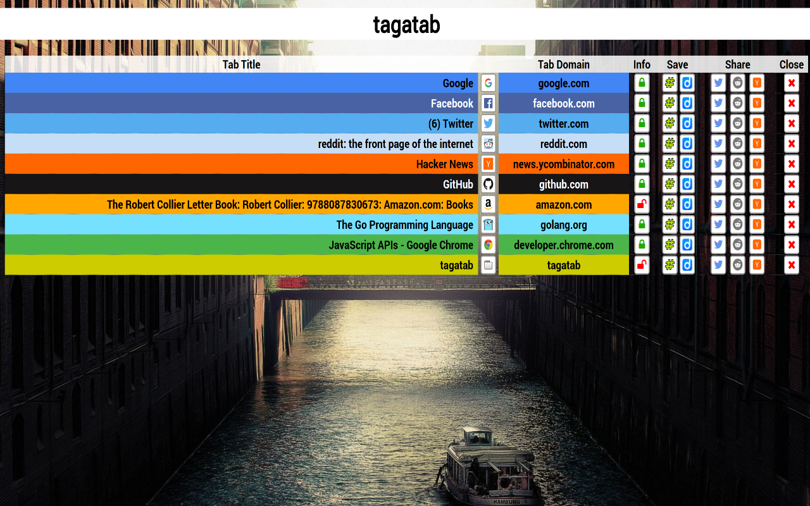

# tagatab

## About

Ever feel like you have way, way too many tabs open, and you can't keep track
of them all? Try tagatab: a simple Chrome extension designed to help you
easily manage all your tabs from one place.

## Features

__Current__

- Share tabs on Twitter, reddit, and Hacker News
- Save tabs on Diigo (more services to come!)
- Sort tabs by domain, title
- Switch to a tab by clicking its title
- Close a tab
- See audible tabs and toggle mute by clicking the audio icon
- Omnibar (keyword "tat")
    - Search open tabs by typing the title
    - Switch to tagatab (hit enter)
- View HTTP / HTTPS status of tabs
- Tab rows are colored based on the tab's favicon

__Future?__
- Bookmark tabs
- Re-arrange tabs with 

Something missing that you'd like to see? File an issue, please! :)

## License

tagatab is licensed under the "new" BSD 3-clause [license](./LICENSE). 
